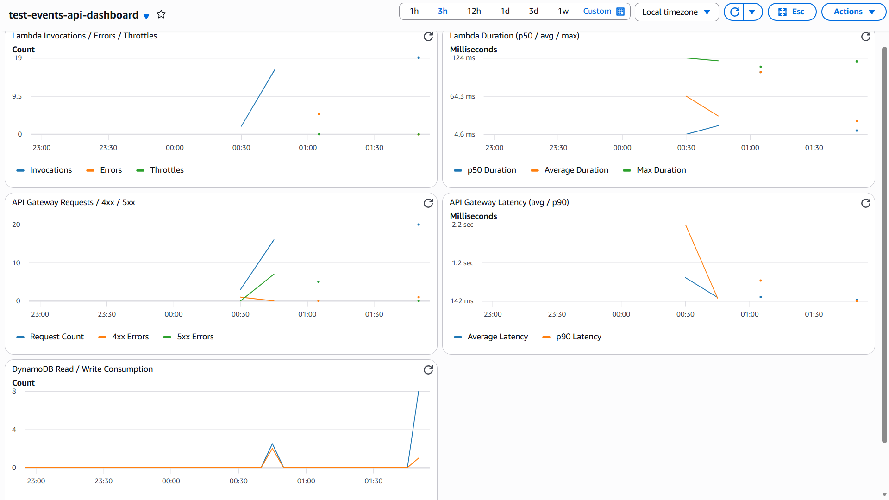

# 🚀 AWS Serverless Events API (Full IaC + CI/CD) 

A **serverless event management API** built using AWS services with:

- Full Infrastructure as Code (AWS SAM / CloudFormation)  
- JWT Authentication (Cognito)  
- Pagination support  
- CloudWatch Monitoring Dashboard  
- CI/CD pipeline using GitHub Actions (OIDC, no access keys)  

---

# 🧠 Architecture

Client (Postman / Browser)
        ↓
API Gateway (HTTP API)
        ↓
Lambda (FastAPI via Mangum)
        ↓
DynamoDB (Events Table + GSI)

Authentication Flow:
User → Cognito Hosted UI → JWT Token → API Gateway Authorizer → Lambda

---

# 🛠 Tech Stack

- AWS Lambda  
- API Gateway (HTTP API)  
- DynamoDB (with GSI for date-based queries)  
- Amazon Cognito (JWT Auth)  
- CloudWatch (Logs + Dashboard)  
- AWS SAM (Infrastructure as Code)  
- GitHub Actions (CI/CD with OIDC)  
- FastAPI + Mangum  

---

# 📦 Features

## API Features
- Create Event  
- Get Event  
- List Events (with pagination)  
- List Events by Date (via GSI)  
- Delete Event  

## Advanced Features
- Pagination using next_token
- JWT-based authentication (Cognito)
- Structured logging

---

# 📊 CloudWatch Dashboard

Includes monitoring for:
- Lambda Invocations, Errors, Duration  
- API Gateway Requests, Latency, 4xx/5xx  
- DynamoDB Read/Write capacity  

---

# ⚙️ Setup Instructions

## 1. Clone Repo
git clone https://github.com/hy3333/aws-serverless-events-api.git
cd aws-serverless-events-api

## 2. Deploy Infrastructure (Manual Bootstrap)
cd infra
sam build --no-cached
sam deploy --guided

---

# 🔁 CI/CD (GitHub Actions)

git push
→ GitHub Actions
→ Assume AWS role via OIDC
→ sam build
→ sam deploy
→ Stack updated

---

# ⚠️ Important Config Notes

## Fresh Setup
CreateGitHubOidcProvider: "true"
ExistingGitHubOidcProviderArn: ""

## If already exists
CreateGitHubOidcProvider: "false"
ExistingGitHubOidcProviderArn: arn:aws:iam::<account-id>:oidc-provider/token.actions.githubusercontent.com

---
  

# 👨‍💻 Author
Himanshu Yadav
